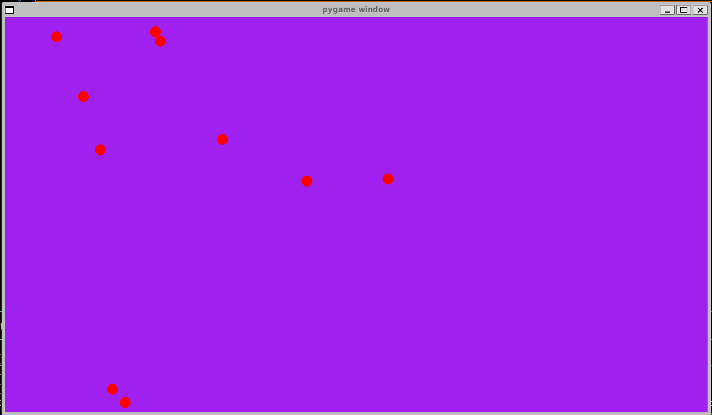

# PyGravitas

> An interactive 2D N-body physics sandbox built with Python, Pygame, NumPy, and SciPy.

---



## About The Project

**PyGravitas** is a portfolio project that simulates the gravitational interaction of N bodies in a 2D "sandbox" environment. It bridges the gap between raw computational power (NumPy/SciPy) and interactive visualizations (Pygame).

KEY FEATURES:
* **Vectorized Physics:** core calculations use `NumPy` broadcasting, avoiding slow Python loops and allowing for complex N-to-N interactions.
* **Accurate Integration:** employs `scipy.integrate.solve_ivp` (using the Runge-Kutta 5(4) method) for numerically stable orbits, superior to basic Euler integration.
* **Topological Continuity:** implements toroidal wrapping with Minimum Image Convention (MIC) to maintain energy conservation across boundaries.
* **Energy conservation:** tools are provided to compute and visualize real-time kinetic, potential, and total energy data .

### Physics Implementation: Unit Normalization

A critical design choice was made to handle physical constants. Standard SI values for Gravity ($G \approx 6.674 \times 10^{-11}$) result in effectively zero movement when rendering to a pixel grid.

To achieve dynamic, observable movement, this simulation uses **Unit Normalization**:
* **Distance (1 unit)** = 1 pixel
* **Mass (1 unit)** = 1 abstract mass unit
* **Time (1 unit)** = 1 second

We derive a **Scaled Gravitational Constant ($G_{scaled}$)** by working backward from a desired typical acceleration ($a \approx 100 \text{ px}/s^2$):
$$G_{scaled} = a \frac{r^2}{m} \approx 1,000,000$$

This custom constant ensures that gravitational forces produce immediate, visible velocity changes on the screen.

## Physics & Numerical Stability

Creating a stable N-body simulation requires addressing inherent numerical challenges. `PyGravitas` implements standard scientific computing techniques to ensure physical accuracy and energy conservation.

### Periodic Boundary Conditions (PBCs)
To avoid the energy discontinuities caused by particles bouncing off "hard" screen edges, the simulation employs a toroidal topology.

1.  **Coordinate Wrapping:** Particles that exit one side of the simulation domain $L$ instantly re-enter from the opposite side, maintaining continuous velocity.
    $$x_{wrapped} = x \pmod L$$
2.  **Minimum Image Convention:** To ensure energy conservation, particles must always interact via the shortest path on the torus. The distance vector $\Delta \vec{x}$ between two particles $i$ and $j$ is adjusted so that no component exceeds $L/2$:
    $$\Delta x_{mic} = \Delta x - L \cdot \text{nint}\left(\frac{\Delta x}{L}\right)$$
    *(Where $\text{nint}$ is the nearest integer function)*. This ensures a particle near the right edge correctly feels a strong force from a particle near the left edge, as they are topologically adjacent.

### Gravitational Softening
In a pure Newtonian model, the force $F \propto 1/r^2$ approaches infinity as the distance $r \to 0$. In a discrete-time simulation, these close encounters cause massive, unphysical force spikes that break energy conservation (the "slingshot" effect).

To prevent this, we employ a softened gravitational force. By adding a softening parameter $\epsilon^2$ to the denominator, we effectively treat particles as having a finite size, capping the maximum force during overlaps:

$$\vec{F} = -G_{scaled} \frac{m_1 m_2}{r^2 + \epsilon^2} \hat{r}$$

Where:
* $r$ is the distance between particles.
* $\hat{r}$ is the unit vector pointing from particle 1 to particle 2.
* $\epsilon$ is the softening length (tuned to approx. $1/2$ particle radius).

## Getting Started

### Installation

1. Clone the repo:
   ```sh
   git clone https://github.com/YosemiteSam92/PyGravitas.git
   ```
2. Install dependencies:
    ```sh
    pip install -r requirements.txt
    ```
 ### Usage
 Run the main simulator:
 ```sh
 python main.py
 ```

### Profiling performance
To analyze the performance bottlenecks of the N-body calculations, run with the ```--profile``` flag:
```sh
 python main.py --profile
 ```
Once closed, analyze the generated stats file:
```sh
cd scripts
python profile_analyzer.py particle_sim.prof
```
### Calculating the system's total energy
To verify the physical accuracy of the simulation, the system's kinetic, potential and total energy is computed and dumped to ```logs/energy_logs.csv```. To visualize it, run:
```sh
cd scripts
plot_energies.py
```

## Built With

* [Python 3.10](https://www.python.org/)
* [Pygame](https://www.pygame.org/)
* [NumPy](https://numpy.org/)
* [SciPy](https://scipy.org/)

## License

Distributed under the MIT License. See `LICENSE` for more information.